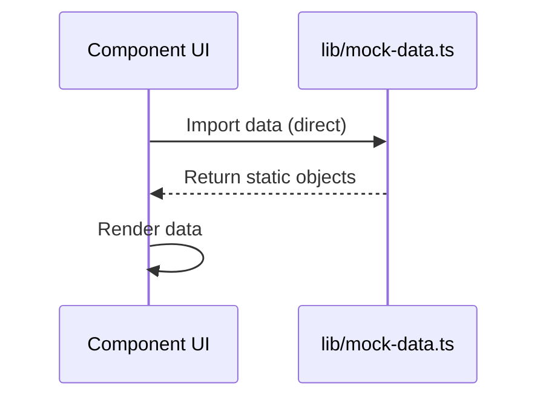
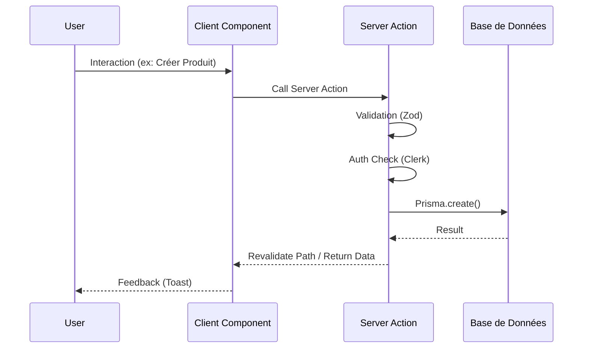

# Diagrammes d'Architecture

Cette section détaille l'architecture de l'application, les flux de données et la structure des composants.

## 🏗 Architecture Globale

L'application suit une architecture **Next.js App Router**, où le frontend et le backend (API routes/Server Actions) sont co-localisés.

```mermaid
graph TD
    User[Utilisateur] --> CDN[CDN / Edge]
    CDN --> NextJS[Next.js Server]

    subgraph "Application Next.js"
        NextJS --> Pages[Pages (React SC)]
        NextJS --> API[API Routes / Server Actions]

        Pages --> Components[Client Components]
        Components --> Hooks[Custom Hooks]
    end

    subgraph "Data & External Services"
        API --> Prisma[Prisma ORM]
        Prisma --> DB[(Base de Données)]

        Components --> Clerk[Clerk Auth]
        API --> Clerk
    end
```

## 📂 Structure des Dossiers

L'organisation des fichiers suit les conventions Next.js App Router :

```mermaid
graph TD
    Root[/] --> App[app/]
    Root --> Components[components/]
    Root --> Lib[lib/]

    App --> Dashboard[(dashboard)/]
    Dashboard --> Features[Feature Routes]
    Features --> Clients[clients/]
    Features --> Products[products/]
    Features --> Sales[sales/]

    Components --> UI[ui/ (Shadcn)]
    Components --> FeatureComps[Feature Components]
    FeatureComps --> C_Clients[clients/]
    FeatureComps --> C_Products[products/]

    Lib --> Utils[utils.ts]
    Lib --> Mock[mock-data.ts]
```

## 🔄 Flux de Données (Actuel vs Cible)

### État Actuel (Mock Data)
Actuellement, l'application utilise des données statiques définies dans `lib/mock-data.ts`.



### Architecture Cible (Prisma + DB)
L'objectif est de migrer vers une architecture dynamique :



## 🧩 Hiérarchie des Composants Clés

Exemple pour la page Produits :

```mermaid
graph TD
    Page[Page.tsx (Products)] --> Header[Page Header]
    Page --> Actions[Action Bar]
    Page --> Table[ProductTable]

    Actions --> Filters[ProductFilters]
    Actions --> AddBtn[Add Product Button]

    AddBtn --> Dialog[ProductForm Dialog]
    Dialog --> Form[ProductForm]

    Table --> Row[Row Item]
    Row --> Menu[Row Actions]
    Menu --> Edit[Edit]
    Menu --> Delete[Delete]
```
